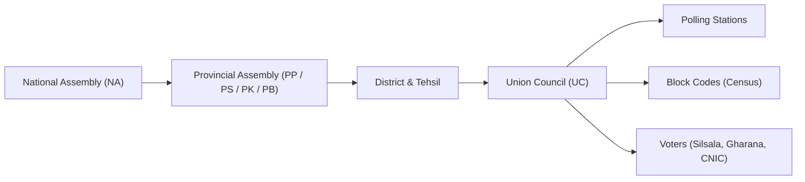

# 🗳️ Smart VoterApp: 15-Slide Master Pitch Deck
### *The Ultimate Offline Voter Search & Polling Booth Mobilization System for Pakistan Elections*

---

## 📑 Slide Directory & Overview

1. **Slide 1**: Title & Executive Cover (Winning the Polling Day)
2. **Slide 2**: The Ground Reality & Election Day Crisis
3. **Slide 3**: The Modern Solution: Smart VoterApp
4. **Slide 4**: Pakistan Electoral Hierarchy Architecture
5. **Slide 5**: The Candidate Model (UC-Scoped Licensing)
6. **Slide 6**: Strict Multi-Device Security & Agent Allocation
7. **Slide 7**: 100% Offline Architecture (Zero Internet Required)
8. **Slide 8**: Instant Voter Search Capabilities
9. **Slide 9**: Digital Voter Parchi (Slip) Generation
10. **Slide 10**: Data Isolation, Security & Anti-Leak Protection
11. **Slide 11**: Silent Background Analytics & Campaign Telemetry
12. **Slide 12**: Central Command War Room (Web CMS Dashboard)
13. **Slide 13**: Traditional Paper Lists vs. Smart VoterApp (ROI Comparison)
14. **Slide 14**: Commercial Packages & Pricing Tiers
15. **Slide 15**: Seamless Onboarding, Support & Call to Action

---

<!-- slide -->

# Slide 1: Title & Executive Cover

### **VOTERAPP 2026**
#### *Smart, Instant & 100% Offline Voter Management for Modern Election Campaigns*

> **Sub-headline**: "Empower your Polling Agents with Instant 1-Second Voter Verification — Even Without Internet."

- **Target Audience**: Local Government Candidates (Chairman / Vice Chairman / Councilor), MPA (Provincial Assembly), MNA (National Assembly), Campaign Strategy Chiefs.
- **Presenter**: Campaign Technology Solutions.

> 🗣️ **Speaker Script / Pitch Cue**:
> *"Election is won or lost at the polling booth. On election day, when thousands of voters line up and internet services are jammed, the candidate whose polling agents find voter numbers in 2 seconds wins the mobilization race. That is why we built VoterApp."*

---

<!-- slide -->

# Slide 2: The Ground Reality & Election Day Crisis

### **Why Conventional Election Day Operations Fail?**

```
❌ The Paper Chaos:
• Thousands of printed paper pages spread across 20-30 polling camps.
• Searching 1 voter in paper lists takes 3 to 7 minutes.
• Long queues cause voter frustration — up to 15-20% voters leave without casting votes.

❌ The Internet Blackout:
• Mobile signals and 4G/3G data are often throttled or suspended on election days for security.
• Cloud-only apps fail completely when internet goes down.

❌ Agent Disorganization:
• Polling agents lack coordination, leading to duplicate voter slips and wasted time.
```

> 🗣️ **Speaker Script / Pitch Cue**:
> *"Har election me candidate caroron kharch karta hai, lekin polling day par voter parchi dhoondne me 5 minute lag jate hain. Voter garmi aur line se tang aa kar wapis chala jata hai. VoterApp is masle ko jarr se khatam karta hai."*

---

<!-- slide -->

# Slide 3: The Modern Solution: Smart VoterApp

### **High-Speed Mobile App + Central Campaign CMS**

- **⚡ Instant 1-Second Search**: Type CNIC or Name $\rightarrow$ Instant Silsala No (سلسلہ نمبر), Gharana No (گھرانہ نمبر), and Polling Station.
- **📶 100% Offline Operation**: Complete UC voter database cached directly on every agent’s smartphone. Zero internet needed.
- **👥 Multi-Device Team Quota**: 1 Candidate license can be shared across 20+ polling agents simultaneously.
- **📊 Real-time Campaign Telemetry**: Live search analytics and device status monitored in your campaign war room.

> 🗣️ **Speaker Script / Pitch Cue**:
> *"Hum aapke poore polling team ko ek aisi app dete hain jo offline chalti hai. 1 second me voter ka silsala number, gharana number aur polling station room number screen par hazir."*

---

<!-- slide -->

# Slide 4: Pakistan Electoral Hierarchy Architecture

### **Built Specifically for Pakistan's Election Framework**



- Supports complete hierarchy:
  - **National Assembly (NA)**: NA-1 to NA-266.
  - **Provincial Assemblies**: Punjab (PP), Sindh (PS), KPK (PK), Balochistan (PB).
  - **Local Government**: District $\rightarrow$ Tehsil $\rightarrow$ Union Council (UC) $\rightarrow$ Block Codes & Polling Stations.
- Seamlessly scales from a single UC Ward election up to an entire National Assembly constituency.

---

<!-- slide -->

# Slide 5: The Candidate Model (UC-Scoped Licensing)

### **Tailored Exclusively for Your Union Council**

- **Dedicated Candidate Account**:
  - Secure Candidate Login (Email & Password).
  - Exclusively locked to your registered Union Council (e.g., *UC-14 Data Ganj Bakhsh*).
- **Zero Confusion / Clean Data**:
  - Polling agents only see voters from your specific UC. No clutter from outside areas.
  - Fast search response time (< 50 milliseconds per query).
- **Turnkey Setup**:
  - Candidate provides their email; our technical team imports the official voter list and delivers a ready-to-use app in 24 hours.

> 🗣️ **Speaker Script / Pitch Cue**:
> *"Aapko sirf apni UC ka data milega — 100% verified aur clean. Aapke workers ko kisi aur UC ka irrelevant data nahi dekhna parega."*

---

<!-- slide -->

# Slide 6: Strict Multi-Device Security & Agent Allocation

### **Control Exactly Who Uses Your App**

| Feature | Description |
| :--- | :--- |
| **Simultaneous Logins** | 1 Candidate account allows **20 Active Devices** (expandable up to 50+). |
| **Device Hardware Lock** | Each smartphone is registered via a unique device hardware UID. |
| **Automated 21st Device Rejection** | Unauthorized extra devices are blocked automatically. |
| **1-Click Remote Revoke** | Lost phone or rogue worker? Admin can instantly revoke access from the web dashboard. |

> 🗣️ **Speaker Script / Pitch Cue**:
> *"Aap 20 polling agents ko app den. Koi agent kisi gher-mutaliqa shakhs ko password nahi de sakta kyun ke 21st phone par app login hi nahi hogi. Aapke hath me pura control hai."*

---

<!-- slide -->

# Slide 7: 100% Offline Architecture (Zero Internet Needed)

### **How We Guarantee Zero Downtime on Polling Day**

```
Step 1: Install App & Login (When Online)
         ⬇
Step 2: 1-Click Fast Sync (Downloads complete UC database into phone's SQLite)
         ⬇
Step 3: INTERNET OFF ✈️
         ⬇
Step 4: All 20,000+ UC Voters Searchable in Milliseconds Offline
```

- **Built-in Local Database Engine**: Powered by optimized embedded SQLite.
- **Zero Network Latency**: Searches run directly on the phone's hardware without sending requests to external servers.
- **Battery Efficient**: Runs without GPS or heavy continuous data draining.

---

<!-- slide -->

# Slide 8: Instant Voter Search Capabilities

### **Search Any Voter in 4 Different Ways**

1. **Search by CNIC (شناختی کارڈ)**:
   - Type with or without dashes (e.g., `35201-1234567-8` or `3520112345678`).
2. **Search by Urdu / English Name (نام)**:
   - Smart partial name matching (e.g., `محمد عثمان` or `Usman`).
3. **Search by Gharana Number (گھرانہ نمبر)**:
   - Pull up all voters belonging to the same household in one single click.
4. **Search by Silsala Number & Block Code (سلسلہ نمبر / بلاک کوڈ)**:
   - Verify serial number against paper records instantly.

> 🗣️ **Speaker Script / Pitch Cue**:
> *"Sirf CNIC ka aakhri hissa ya naam likhein — puray khandan ke votes aik sath screen par show ho jayen ge!"*

---

<!-- slide -->

# Slide 9: Digital Voter Parchi (Slip) Generation

### **Send Instant Voter Slips via WhatsApp / SMS / Print**

- **Digital Parchi Output Includes**:
  - Voter Name & Father's/Husband's Name.
  - CNIC Number.
  - Silsala No (سلسلہ نمبر).
  - Gharana No (گھرانہ نمبر).
  - Polling Station Name & Polling Booth / Room Number.
  - Block Code & Ward Details.
- **1-Tap WhatsApp Share**: Direct sharing to voter's WhatsApp before they leave their home.
- **Thermal Bluetooth Printer Support**: Instant 2-second printed slip at the candidate's camp.

---

<!-- slide -->

# Slide 10: Data Isolation, Security & Anti-Leak Protection

### **Your Campaign Intelligence Remains 100% Private**

- 🛡️ **Encrypted Local Storage**: Data stored in phone memory cannot be extracted or stolen by opposition agents.
- 🔒 **UC Boundary Isolation**: Candidate A cannot view Candidate B's data.
- 📱 **Session Fingerprinting**: Detects rooted devices, unauthorized clones, or IP spoofing.
- 🚫 **Anti-Export Lockdown**: Mobile agents cannot export or dump raw database files to Excel.

---

<!-- slide -->

# Slide 11: Silent Background Analytics & Campaign Telemetry

### **Know the Ground Reality in Real-Time**

*Whenever any agent's device momentarily catches 4G or Wi-Fi, it silently pings the Central Server:*

- **Live Polling Camp Activity**:
  - How many voter searches were performed at *Camp A* vs. *Camp B*?
- **Turnout Estimation**:
  - Estimated voter turnout percentage updated throughout polling day.
- **Agent Attendance**:
  - Verify which polling agents are active and which booths are running slow.

> 🗣️ **Speaker Script / Pitch Cue**:
> *"Aap apne central office me baith kar screen par dekh sakte hain ke kis polling station par kitne voter search ho chuke hain aur kahan voter turnout kam hai."*

---

<!-- slide -->

# Slide 12: Central Command War Room (Web CMS Dashboard)

### **Executive Control for Campaign Leaders**

- **Unified Control Panel**:
  - Manage all polling agents, assigned UCs, and device limits from desktop, tablet, or mobile.
- **Bulk Voter Import Engine**:
  - Upload raw Excel / CSV files or scan physical voter list pages with built-in OCR.
- **Activity Log & Audit Trail**:
  - Full audit of all searches, logins, and device revocations.

---

<!-- slide -->

# Slide 13: Traditional Paper Lists vs. Smart VoterApp

### **The Winning Advantage (Head-to-Head Comparison)**

| Metric | Traditional Paper Lists | Smart VoterApp |
| :--- | :--- | :--- |
| **Search Speed** | 3 to 7 Minutes per voter | **Under 1 Second** |
| **Internet Dependency** | N/A (Bulky paper mess) | **100% Offline Mobile App** |
| **Household (Gharana) Lookup** | Impossible without turning 50 pages | **1-Click Family View** |
| **Voter Drop-off / Frustration** | High (15-20% leave long queues) | **Virtually Zero Drop-off** |
| **Printing & Stationery Cost** | Rs. 40,000 - 80,000 per UC | **Zero paper printing costs** |
| **Agent Supervision** | Blind / No monitoring | **Live Device Telemetry** |

---

<!-- slide -->

# Slide 14: Commercial Packages & Pricing Tiers

### **Flexible Packages Tailored for Every Election Level**

```
┌────────────────────────┐  ┌────────────────────────┐  ┌────────────────────────┐
│   UC STARTER PLAN      │  │    UC PRO / CHAIRMAN   │  │   CONSTITUENCY MPA/MNA │
│   (For Councilor / UC) │  │    (Most Popular)      │  │   (Full PP / NA Seat)  │
├────────────────────────┤  ├────────────────────────┤  ├────────────────────────┤
│ • 1 Complete UC Data   │  │ • 1 Full UC + All Wards│  │ • Entire PP or NA Seat │
│ • Up to 10 Device App  │  │ • Up to 25 Device App  │  │ • Up to 150+ Devices   │
│ • 100% Offline Search  │  │ • 100% Offline Search  │  │ • Multi-UC War Room    │
│ • WhatsApp Slip Share  │  │ • WhatsApp Slip Share  │  │ • Dedicated Tech Lead  │
│ • Standard Support     │  │ • Live War Room CMS    │  │ • On-Ground Deployment │
│                        │  │ • Priority 24/7 Support│  │ • Custom Branding      │
└────────────────────────┘  └────────────────────────┘  └────────────────────────┘
```
*(Custom pricing customized according to number of voters and device limits).*

---

<!-- slide -->

# Slide 15: Seamless Onboarding & Call to Action

### **Get Your Polling Campaign Tech-Ready in 24 Hours!**

### 🚀 3-Step Instant Deployment:
1. **Step 1**: Send your Union Council name and voter list (Excel/CSV/PDF).
2. **Step 2**: Receive your Candidate Admin credentials & download the mobile app link.
3. **Step 3**: Share login with your 20 polling agents — test offline and dominate election day!

---

### 📞 Contact for Demo & Booking:
- **Campaign Tech Lead**: Solutions Team
- **Direct WhatsApp / Phone**: Available on request
- **Live Interactive Demo**: Available on your test UC within 15 minutes!

---
*(End of Presentation Deck)*
